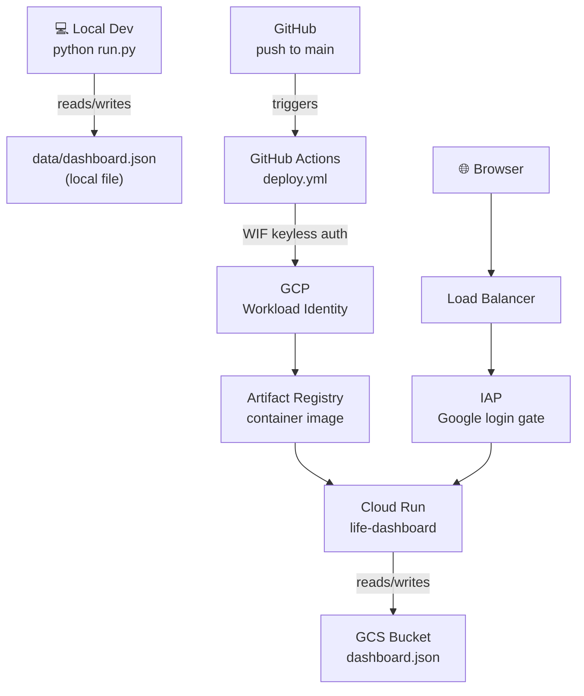
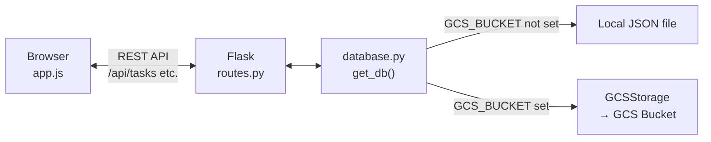
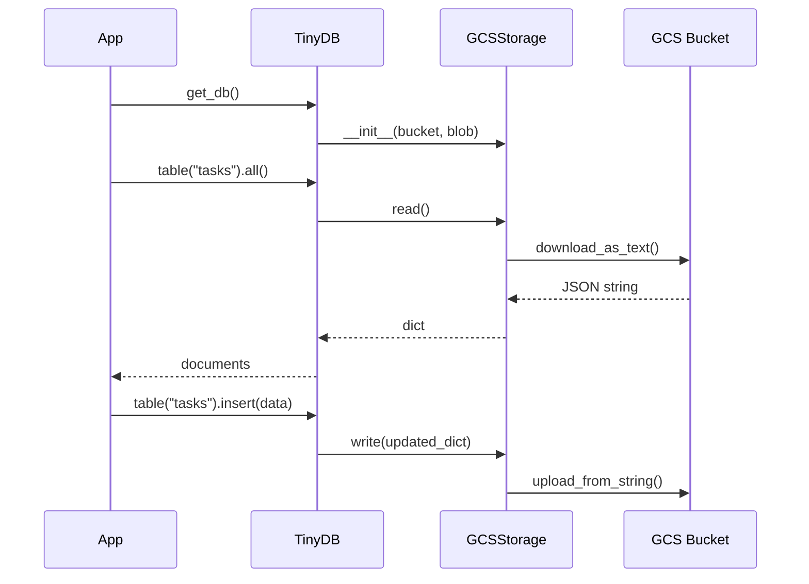
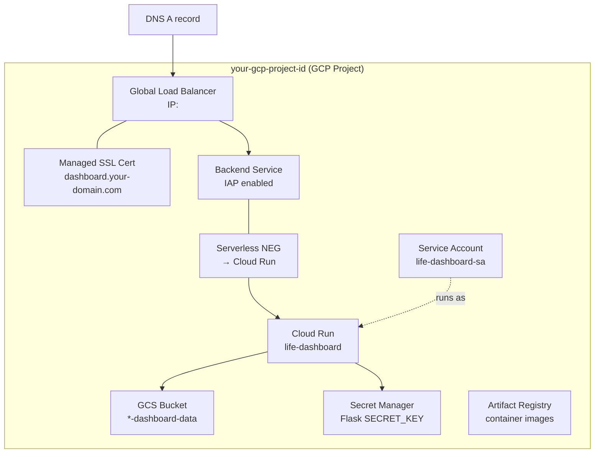
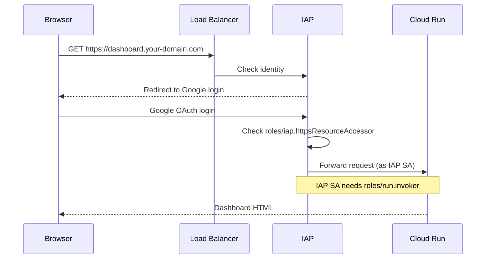
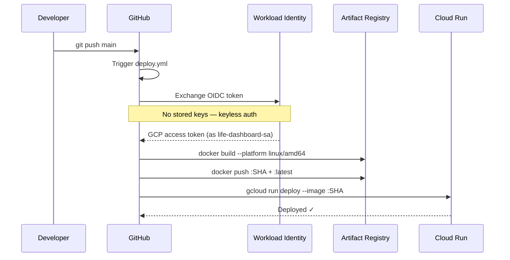

# How It Works — Life Dashboard

A guide to the full system: how the parts fit together locally and in production, how deployments work, and key lessons learned from the build.

> **Note:** the hosted deployment was decommissioned on 2026-08-16 — the GCP project was
> deleted. The remote URLs below are no longer reachable. Running locally
> (`python run.py` → `http://127.0.0.1:5000`) is unaffected.

---

## 1. The Big Picture



The app has two modes determined by a single environment variable:

| Environment | `GCS_BUCKET` set? | Storage backend |
|---|---|---|
| Local (`python run.py`) | No | `data/dashboard.json` on disk |
| Production (Cloud Run) | Yes | `dashboard.json` in GCS bucket |

---

## 2. Application Layer

The dashboard is a **Flask** single-page app backed by **TinyDB** — a lightweight NoSQL database that stores everything as a JSON file.



### Key files

| File | Purpose |
|---|---|
| `run.py` | Entry point — creates the Flask app |
| `app/__init__.py` | App factory, loads config, calls `init_db()` |
| `app/database.py` | Storage abstraction — local file or GCS |
| `app/routes.py` | REST API (`GET/POST/PUT/DELETE` for each table) |
| `app/static/app.js` | All frontend logic — fetch, render, CRUD modals |
| `app/static/style.css` | All styles |
| `app/templates/index.html` | Single HTML shell (Jinja2) |

### TinyDB tables

| Table | Contents |
|---|---|
| `tasks` | Work and personal tasks with priority, due date, done flag |
| `events` | Calendar events with date and time |
| `projects` | Projects with % progress and deadline |
| `year_events` | 2-year roadmap items grouped by quarter |
| `holidays` | Dutch public holidays synced from Nager.Date |
| `recurring` | Recurring events (birthdays etc.) — stored as month/day |
| `gcal_events` | Google Calendar events — synced via service account, read-only |

---

## 3. GCS Storage Backend

In production the app uses a custom TinyDB storage class (`GCSStorage`) instead of the default local file writer. TinyDB calls `read()` and `write()` on every database operation.



**Important:** `GCSStorage` must be passed as a **class** to `TinyDB(storage=GCSStorage, ...)` — not as an instance. TinyDB instantiates it internally with the kwargs you provide.

---

## 4. Container (Docker)

Cloud Run runs a Docker container. A few specifics worth knowing:

```dockerfile
FROM --platform=linux/amd64 python:3.12-slim
```

- **`--platform linux/amd64`** is required when building on Apple Silicon (M-chip Macs). Cloud Run runs on AMD64. Without this flag the container starts with `exec format error`.
- Files are copied as root, then ownership is transferred to `appuser` with `chown -R appuser:appuser /app` — required before switching to the non-root user, otherwise gunicorn can't read the source files.
- **gunicorn** (not Flask's dev server) is used as the WSGI server in production, binding to `0.0.0.0:$PORT` where `$PORT=8080` is Cloud Run's standard.

---

## 5. Production Infrastructure



### IAP authentication flow



### IAP requirements for Cloud Run

Two bindings are needed that aren't obvious:

1. **IAP SA → Cloud Run invoker**: The IAP service account (`service-PROJECT_NUMBER@gcp-sa-iap.iam.gserviceaccount.com`) must have `roles/run.invoker` on the Cloud Run service — this is what lets IAP forward authenticated requests through.
2. **IAP SA must be provisioned first**: It doesn't exist by default. Run `gcloud beta services identity create --service=iap.googleapis.com` to create it before granting the role.

---

## 6. CI/CD Pipeline (GitHub Actions)

Every push to `main` triggers an automated build and deploy.



### Workload Identity Federation

Rather than storing a service account key in GitHub secrets, the workflow uses **Workload Identity Federation**. GitHub Actions gets a short-lived OIDC token which GCP exchanges for a temporary access token scoped to `life-dashboard-sa`. Nothing long-lived is ever stored.

The service account needs three roles to deploy:

| Role | Why |
|---|---|
| `roles/artifactregistry.writer` | Push container images |
| `roles/run.developer` | Deploy Cloud Run revisions |
| `roles/iam.serviceAccountUser` (on itself) | Attach itself as the runtime SA when creating a revision |

---

## 7. DNS

The domain is managed in your DNS provider. An A record for `dashboard.your-domain.com` points to the Load Balancer IP. The SSL certificate is a **Google-managed cert** that auto-renews — it provisions within ~15 minutes of the A record being set.

---

## 8. Lessons Learned

| Issue | Cause | Fix |
|---|---|---|
| `exec format error` on Cloud Run | Image built for ARM64 (Apple Silicon) but Cloud Run is AMD64 | `docker build --platform linux/amd64` and `FROM --platform=linux/amd64` in Dockerfile |
| `Permission denied: __init__.py` | Files copied as root, non-root user can't read them | `RUN chown -R appuser:appuser /app` before `USER appuser` |
| `GCSStorage object is not callable` | TinyDB was passed an instance rather than a class | Pass the class: `TinyDB(storage=GCSStorage, ...)` not `TinyDB(storage=GCSStorage(...))` |
| IAP SA does not exist | IAP service account is not auto-created | `gcloud beta services identity create --service=iap.googleapis.com` |
| `Service Unavailable` behind LB | IAP SA couldn't invoke Cloud Run | Grant `roles/run.invoker` to the IAP service account on the Cloud Run service |
| `iam.serviceaccounts.actAs` denied | SA can't attach itself as runtime identity | Grant `roles/iam.serviceAccountUser` to SA on itself |

---

## 9. Local Development Reference

```bash
# Start the app
source venv/bin/activate
python run.py
# → http://127.0.0.1:5000

# Backup data from GCS
gcloud storage cp gs://YOUR_PROJECT-dashboard-data/dashboard.json ./data/dashboard.json

# Restore data to GCS
gcloud storage cp ./data/dashboard.json gs://YOUR_PROJECT-dashboard-data/dashboard.json

# Manual redeploy (without GitHub Actions)
docker build --platform linux/amd64 -t europe-west4-docker.pkg.dev/YOUR_PROJECT/life-dashboard/app:latest .
docker push europe-west4-docker.pkg.dev/YOUR_PROJECT/life-dashboard/app:latest
gcloud run deploy life-dashboard --image=europe-west4-docker.pkg.dev/YOUR_PROJECT/life-dashboard/app:latest --region=europe-west4 --project=YOUR_PROJECT
```
