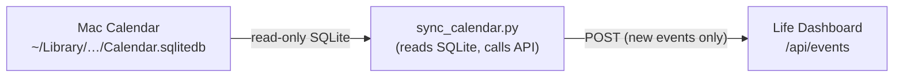

# Mac Calendar Sync

> **Note:** The dashboard now supports native Google Calendar sync via `POST /api/gcal/sync` (service account, no script needed). See [ARCHITECTURE.md](ARCHITECTURE.md#google-calendar-sync--gcal_events-table) and the GCal button in the Upcoming Events panel. This script remains useful if you want to pull events from non-Google calendars on your Mac (e.g. iCloud-only calendars).

`scripts/sync_calendar.py` is a macOS-only helper that reads upcoming events directly from the Mac Calendar SQLite database and pushes them to the dashboard API.

---

## How It Works



1. Opens the Calendar database in **read-only** mode — it never writes to Apple Calendar.
2. Queries events within a configurable window (default: 30 days ahead).
3. Skips calendars listed in `SKIP_CALENDARS` (see below).
4. Fetches existing dashboard events and deduplicates by `title.lower() + date` before posting.

---

## Requirements

- macOS (the Calendar SQLite database path is macOS-specific)
- Python 3.9+
- `python-dotenv` (already in `requirements.txt`)
- Full Disk Access granted to the terminal / app running the script — macOS restricts access to `~/Library/Group Containers/…` without it

---

## Setup

1. Copy `.env.example` to `.env` and set:

   ```
   DASHBOARD_URL=http://127.0.0.1:5000
   API_KEY=                               # leave blank when running locally
   ```

2. Activate the virtual environment:

   ```bash
   source venv/bin/activate
   ```

---

## Usage

### Preview (dry run)

See what would be imported without making any changes:

```bash
python scripts/sync_calendar.py sync --dry-run
```

### Sync (default 30 days)

```bash
python scripts/sync_calendar.py sync
```

### Sync a custom window

```bash
python scripts/sync_calendar.py sync --days 90
```

### List available calendars

Show all calendars in the Mac Calendar database, their event counts, and which ones would be skipped:

```bash
python scripts/sync_calendar.py calendars
```

---

## Skipped Calendars

The following calendars are excluded from the sync because they contain noise or duplicate data that is already handled by the dashboard's own recurring-events and Dutch-holidays features:

| Calendar | Reason |
|---|---|
| Birthdays | Handled by the dashboard recurring events |
| Siri Suggestions | Auto-generated, low signal |
| Scheduled Reminders | Reminders, not calendar events |
| Found in Mail | Auto-detected, low signal |
| Found in Natural Language | Auto-detected, low signal |
| Facebook Birthdays | Duplicate of recurring events |

To skip additional calendars, add them to `SKIP_CALENDARS` in `scripts/sync_calendar.py`.

---

## Deduplication

Events are deduplicated on `(title.lower(), date)`. Running the sync multiple times or extending the window is always safe — existing events are never modified or deleted.

---

## Production Use

The script targets whichever `DASHBOARD_URL` is set in `.env`. To sync against the production dashboard:

```
DASHBOARD_URL=https://dashboard.your-domain.com
API_KEY=<your-key>
```

Because the production dashboard is behind Google IAP, direct script access requires either:
- A service account with `roles/iap.httpsResourceAccessor` and an OIDC token, or
- Running the script against the local dev server and letting the local server sync to GCS on the next dashboard load.
